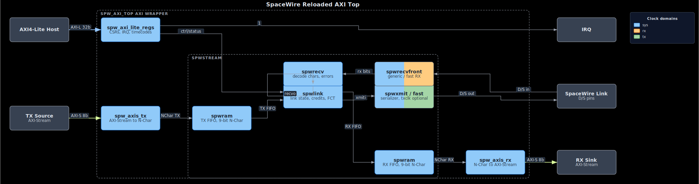

# SpaceWire Reloaded

Author: Leonardo Capossio - bard0 design - hello@bard0.com - 2026

SpaceWire Reloaded is a planned LGPL continuation and cleanup of the SpaceWire Light core by Joris van Rantwijk. The project goal is to keep the useful SpaceWire encoder/decoder architecture while replacing the GRLIB-dependent AMBA integration with an LGPL-compatible AMBA/AXI implementation owned by this repository.

The original SpaceWire Light source tree has been imported as a baseline. The imported source has not been modified as part of the initial import.

## Index

- [Project Goals](#project-goals)
- [License Direction](#license-direction)
- [Original Project README](#original-project-readme)
- [Imported Baseline](#imported-baseline)
- [Planned Features](#planned-features)
- [AMBA/AXI Porting Plan](#ambaaxi-porting-plan)
- [Current AXI Work](#current-axi-work)
- [How to Use and Test](#how-to-use-and-test)
- [Hardware Example: Arty A7-100T Loopback](#hardware-example-arty-a7-100t-loopback)
- [FPGA Resource Usage and Timing](#fpga-resource-usage-and-timing)
- [Author and License](#author-and-license)

## Project Goals

- Preserve a small, portable SpaceWire link core suitable for FPGA designs.
- Keep the full core, including bus interfaces, under an LGPL-compatible license.
- Remove dependency on GPL-only GRLIB AMBA wrapper code.
- Provide clean, vendor-neutral RTL wrappers for architecture-specific resources such as FIFOs and RAMs.
- Build an OS-agnostic Python-based flow for linting, simulation, regression, and FPGA builds.
- Add CI with GitHub Actions once the source tree and regression entry points exist.

## License Direction

The intended license for this repository is LGPL. The AMBA/AXI implementation will be written for this project instead of importing GPL GRLIB-dependent source. Any imported upstream files must be reviewed before inclusion so that license provenance remains clear.

This repository includes the LGPL license text for the active source tree. Historical GPL references remain only in the preserved upstream README so the removed GRLIB-dependent AMBA context stays visible without licensing the current source as GPL.

## Original Project README

The original SpaceWire Light README is preserved as [README.spacewire_light.md](README.spacewire_light.md). It documents the upstream project history, original architecture, licensing notes, GRLIB-dependent AMBA interface, and prior Verilog translation work.

This top-level README is intentionally new and describes the SpaceWire Reloaded project direction.

## Imported Baseline

The current tree includes the upstream SpaceWire Light RTL, benches, simulations, documentation, synthesis examples, software support files, scripts, parity material, CI workflows, and LGPL license text.

The imported GRLIB-dependent implementation files and LEON3/SPWAMBA support examples have been removed from this repository. Historical references remain in the preserved upstream README so the reason for the replacement work is still visible.

Important imported areas:

- `rtl/vhdl`: original VHDL RTL after removal of the GRLIB-dependent AMBA files.
- `rtl/verilog`: Verilog 2001 translation of the standalone non-GRLIB core.
- `bench`: VHDL and Verilog test benches.
- `sim`: simulation setups.
- `syn`: synthesis example projects.
- `sw`: software and driver examples.
- `doc`: manual and architecture documentation.
- `scripts`: Python helper scripts.
- `parity`: translation and parity verification material.

The planned replacement AMBA/AXI implementation must be LGPL-compatible and must not import GPL GRLIB source.

## Planned Features

- SpaceWire encoder/decoder core.
- FIFO-style streaming application interface.
- LGPL AMBA AHB/APB integration layer.
- LGPL AXI4-Lite register interface.
- Optional AXI4 or AXI4-Stream data movement interface, to be selected after the architecture is documented.
- Register map with register 0 as a core identifier and the next register as a version register.
- Portable wrappers for RAM, FIFO, reset, and clock-domain crossing primitives.
- Lint, simulation, and regression targets runnable from a clean checkout.

## AMBA/AXI Porting Plan

1. Document the standalone SpaceWire Light interfaces and the removed GRLIB-dependent AMBA behavior from preserved upstream documentation and history.
2. Define a bus-neutral internal control/data interface for the SpaceWire core.
3. Implement LGPL bus wrappers around that internal interface:
   - AHB/APB wrapper for AMBA-style systems.
   - AXI4-Lite wrapper for control and status.
   - AXI data path option after DMA requirements are settled.
4. Build self-checking simulations for register access, DMA/data movement, interrupt behavior, reset behavior, and error paths.
5. Add lint and regression targets before FPGA build flows.
6. Add FPGA build examples only after simulation coverage is in place.

## Current AXI Work

The first LGPL AXI replacement slice is in progress:

- `rtl/vhdl/spw_axi_lite_regs.vhd`: AXI4-Lite control/status register block.
- `rtl/vhdl/spw_axis_tx.vhd`: AXI-Stream to SpaceWire N-Char TX bridge.
- `rtl/vhdl/spw_axis_rx.vhd`: SpaceWire N-Char RX to AXI-Stream bridge.
- `rtl/vhdl/spw_axi_top.vhd`: VHDL top-level wrapper around `spwstream`.
- `rtl/verilog/spw_axi_lite_regs.v`: Verilog AXI4-Lite register block.
- `rtl/verilog/spw_axis_tx.v`: Verilog AXI-Stream TX bridge.
- `rtl/verilog/spw_axis_rx.v`: Verilog AXI-Stream RX bridge.
- `rtl/verilog/spw_axi_top.v`: Verilog top-level wrapper used by the local cocotb/Icarus integration regression.

### System Architecture

[](docs/architecture.svg)

The first AXI wrapper keeps the original `spwstream` data/control split: AXI4-Lite owns CSRs, IRQ, link control, and timecodes, while AXI-Stream carries SpaceWire N-Chars through dedicated TX and RX bridges. The diagram opens `spwstream` one level deeper to show the link controller, receiver, selectable RX/TX front ends, and RX/TX RAM-backed N-Char FIFOs.

The AXI-Stream data path is currently an N-Char stream:

- `tdata[7:0]` carries a data byte, EOP code, or EEP code.
- `tlast` is asserted on EOP/EEP control characters.
- `tuser[0]` is meaningful only when `tlast` is asserted: `0` selects EOP, and `1` selects EEP.

This preserves SpaceWire's explicit EOP/EEP characters and avoids hiding them inside the previous data byte.

### Clock-Domain Crossing and Timing Constraints

The core runs three clocks: the system clock `clk`, the receive sample clock `rxclk`, and the transmit bit clock `txclk`. Every crossing between them passes through the two-flip-flop `syncdff` synchronizer. The receive buffer head pointer is gray-coded before it crosses from `rxclk` to `clk`, so the system domain can never sample an illegal intermediate pointer value while the pointer increments; the activity counter crosses as binary on purpose because it is only change-detected. The synchronizer flip-flops carry vendor-neutral attributes (`ASYNC_REG` for Xilinx, `syn_preserve`/`syn_srlstyle` for Synplify/Lattice, `preserve` for Intel, plus `keep`) so the same RTL builds correctly across vendors.

CDC timing-constraint templates live in [`constraints/`](constraints/): `spw_cdc.xdc` (Xilinx Vivado), `spw_cdc.sdc` (Intel Quartus), and `spw_cdc_lattice.sdc` (Lattice), with [`constraints/README.md`](constraints/README.md) covering usage and the required `bitrate < rxchunk x sysclk` rate rule. They are validated-intent templates and have not yet been run through the vendor back ends.

### AXI-Lite Register Map

The AXI-Lite control/status block uses 32-bit little-endian registers. All registers return `OKAY` responses; unmapped locations read as zero and ignore writes. Hardware reset clears `CONTROL`, `TXDIVCNT`, TimeCode state, sticky errors, and IRQ enable state.

| Offset | Name | Access | Reset | Description |
| --- | --- | --- | --- | --- |
| `0x00` | `CORE_ID` | RO | `0x53505752` | Core identifier, ASCII `SPWR`. |
| `0x04` | `VERSION` | RO | `0x00010000` | Core version. |
| `0x08` | `CONTROL` | RW | `0x00000000` | Link control bits. |
| `0x0C` | `STATUS` | RO | live | Link, FIFO, TimeCode, and error status. |
| `0x10` | `TXDIVCNT` | RW | `0x00000000` | Run-state transmit divider, low byte only. The transmitted bit rate is the active TX clock divided by `TXDIVCNT + 1`. Startup uses the derived 10 Mbit/s divider instead. |
| `0x14` | `TIMECODE_TX` | WO | `0x00000000` | Write bits `[7:6]` control and `[5:0]` time. Writing bit `[31]=1` with byte lane 3 strobed emits a one-cycle TimeCode request. |
| `0x18` | `TIMECODE_RX` | RO/W1C | `0x00000000` | Received TimeCode latch. Bit `[31]` is valid, bits `[7:6]` are control, bits `[5:0]` are time. Write `1` to bit `[31]` with byte lane 3 strobed to clear valid; a simultaneous received TimeCode remains latched. |
| `0x1C` | `ERROR` | RO/W1C | `0x00000000` | Sticky SpaceWire error bits. Write `1` to clear selected bits; simultaneous new errors remain latched. |
| `0x20` | `IRQ_ENABLE` | RW | `0x00000000` | Interrupt enable mask for `IRQ_STATUS`. |
| `0x24` | `IRQ_STATUS` | RO/W1C | live | Interrupt source summary. Bits `[0]` and `[1]` clear the same sticky sources as `ERROR` and `TIMECODE_RX`; bits `[2]` through `[4]` are live level sources. |

`CONTROL` bit fields:

| Bits | Name | Description |
| --- | --- | --- |
| `[0]` | `core_rst` | Hold-style soft reset into the SpaceWire core and AXI-Stream bridges. It stays asserted until software writes this bit back to `0`. |
| `[1]` | `autostart` | Enable automatic link start after a received NULL. |
| `[2]` | `linkstart` | Request link start once the core reaches Ready. |
| `[3]` | `linkdis` | Hold the link disconnected and force a running link to disconnect. |
| `[31:4]` | reserved | Write as zero. |

`STATUS` bit fields:

| Bits | Name | Description |
| --- | --- | --- |
| `[0]` | `started` | Link state machine is in Started. |
| `[1]` | `connecting` | Link state machine is in Connecting. |
| `[2]` | `running` | Link is in Run. |
| `[3]` | `txrdy` | Transmit FIFO can accept an N-Char. |
| `[4]` | `txhalff` | Transmit FIFO is at least half full. |
| `[5]` | `rxvalid` | Receive FIFO has an N-Char available. |
| `[6]` | `rxhalff` | Receive FIFO is at least half full. |
| `[7]` | `timecode_rx_valid` | A received TimeCode is latched in `TIMECODE_RX`. |
| `[8]` | `errdisc` | Sticky disconnect error. |
| `[9]` | `errpar` | Sticky parity error. |
| `[10]` | `erresc` | Sticky escape-sequence error. |
| `[11]` | `errcred` | Sticky credit error. |
| `[31:12]` | reserved | Reads zero. |

`ERROR` bit fields are `[0] errdisc`, `[1] errpar`, `[2] erresc`, and `[3] errcred`. `IRQ_STATUS` uses `[0] any sticky error`, `[1] received TimeCode valid`, `[2] RX valid`, `[3] TX ready`, and `[4] link active`, where link active is `started | connecting | running`. The `irq` output is a level signal: `irq = |(IRQ_STATUS & IRQ_ENABLE)`. Because `IRQ_STATUS[2]`, `[3]`, and `[4]` are live level sources, they deassert only when the underlying condition deasserts or their enable bits are cleared; W1C writes affect only the sticky error and TimeCode-valid sources.

## How to Use and Test

The imported baseline includes RTL, benches, scripts, and CI workflows. SpaceWire Reloaded adds a Python build entry point for lint and cocotb regressions.

Clean-checkout flow:

```sh
python build.py lint
python build.py test
python build.py test --hdl vhdl
python build.py test --runner wsl
python build.py vivado --dry-run
```

Install the Python regression dependencies with:

```sh
python -m pip install -r requirements-dev.txt
```

`python build.py test` uses cocotb with `cocotbext-axi`. The test runner supports:

- `--runner auto`: default; prefers WSL on Windows when a WSL distribution is visible, otherwise uses the local environment.
- `--runner wsl`: run cocotb from WSL with `python3`.
- `--runner local`: run cocotb from the current Python environment.
- `--hdl verilog`: default; run the Verilog cocotb regressions with Icarus Verilog.
- `--hdl vhdl`: run the VHDL AXI leaf/register cocotb regressions with GHDL and cocotb VPI.
- `--hdl all`: run both Verilog and VHDL cocotb regressions.

The current cocotb regression runs the shared AXI tests against the Verilog AXI modules with Icarus Verilog and the VHDL AXI modules with GHDL. AXI-Lite tests use `AxiLiteMaster` for register reads, writes, byte strobes, randomized status/control access, reset recovery, independent AW/W ordering, and channel backpressure. AXI-Stream tests use `AxiStreamSource` and `AxiStreamSink` with pause generators for ready/valid backpressure. The top-level AXI regression loops the SpaceWire physical TX/RX pins back through the real `spwstream` core in both Verilog and VHDL, and covers EOP, EEP, empty packets, multiple back-to-back packets, packet-boundary stalls, reset during streaming, link disconnect/reconnect, and TimeCode transfer through AXI-Lite.

For Verilog integration, set `SYS_CLOCK_HZ` to the `clk` frequency and `TX_CLOCK_HZ` to the `txclk` frequency when `TXIMPL=1`. The Verilog AXI top and `spwstream` derive the SpaceWire reset window, disconnect timeout, and startup 10 Mbit/s divider from those clock parameters. The raw `RESET_TIME`, `DISCONNECT_TIME`, and `DEFAULT_DIVCNT` parameters are compatibility overrides; leave them at zero for derived, spec-oriented timing.

The AXI top-level suite has started to mirror the old `spwlink_tb_all` configuration sweep. The cocotb sweep preserves the original clock, divider, RX implementation, RX chunk, TX implementation, and input-rate table, then runs all 23 configurations through the AXI wrapper in both Verilog and VHDL. Loopback-compatible configurations use physical SpaceWire TX/RX loopback through the real core. The high-speed transmitter-only configurations use a cocotb SpaceWire line driver that idles through startup, sends NULLs/FCTs like the original VHDL bench, and checks TX bit timing on the DUT output pins. The external line-driver regression also injects disconnect, double-ESC, parity, and credit-error conditions and checks the AXI-visible sticky error bits.

The cocotb suite also includes simulation-time AXI protocol checkers. AXI-Lite channels are checked for ready/valid payload stability under backpressure. AXI-Stream channels are checked for resolved `TVALID`/`TREADY`, resolved active payloads, stable payload while stalled, bounded stall and packet length, DUT-output `TVALID` clearing during reset, and the SpaceWire N-Char terminal-beat contract: `TLAST` marks EOP/EEP, terminal `TDATA` must be `0` or `1`, and terminal `TUSER[0]` must match the EEP code. These are protocol invariant checks during regression, not a replacement for a future formal proof flow.

VHDL cocotb execution requires a simulator/install combination with a working GHDL cocotb VPI interface. The local runner asks `ghdl` for its VPI library directory so Windows installs with split `bin` and `lib` DLL directories can load cocotb's GHDL VPI module. The GitHub Actions cocotb workflow installs GHDL, Icarus Verilog, and `requirements-dev.txt`, then runs both `--hdl verilog` and `--hdl vhdl`.

## Hardware Example: Arty A7-100T Loopback

[`examples/arty_a7100t/`](examples/arty_a7100t/) is a complete hardware-validation design for the Digilent Arty A7-100T (`xc7a100tcsg324-1`). A single `spw_axi_top` link is run in loopback and verified over JTAG with [fpgacapZero](https://github.com/lcapossio/fpgacapZero) ("fcapz"), which is pulled in as a git submodule. The example ships in both Verilog and VHDL.

- Loopback is internal (`spw_do/spw_so` wired to `spw_di/spw_si` inside the FPGA) or external through Pmod JA, selected by the `LOOPBACK_INTERNAL` generic/parameter.
- A small engine (`spw_loopback_axi`) is the AXI-Lite master that brings the link up and reads back the SpaceWire `CORE_ID`, owns the N-Char AXI-Stream for a fabric self-check and a host data-mover, and presents an AXI4 register file to the fpgacapZero EJTAG-AXI bridge. Two ELAs capture the SpaceWire D/S lines and the received byte; two EIOs and the LEDs mirror link/self-check status.
- The same cocotb test drives the engine over its AXI4 slave (exactly as fcapz does) and passes against both the Verilog (Icarus) and VHDL (GHDL) builds; the `fcapz` host script repeats the checks on real hardware.

See [`examples/arty_a7100t/README.md`](examples/arty_a7100t/README.md) for the register map, build, simulation, and hardware-verification steps, plus resource/timing numbers.

## FPGA Resource Usage and Timing

The CI synthesis report is generated by:

```sh
python scripts/synth_resource_compare.py
```

The current report below was generated with GHDL 5.1.1 and Yosys 0.33 in WSL on 2026-06-13. Resource counts are hierarchical Yosys RTL-level primitive-cell counts after `proc`, `memory`, and `opt`; they are useful for trend tracking but are not vendor FPGA LUT/FF/P&R numbers. The timing column is Yosys `ltp` critical-path logic levels after the same RTL-level synthesis; it is a structural timing-depth metric, not an Fmax guarantee.

| Block | Config | Source | Cells | FF cells | Wires | Wire bits | Memories | Memory bits | Critical path levels |
| --- | --- | --- | ---: | ---: | ---: | ---: | ---: | ---: | ---: |
| AXI-Stream TX bridge | leaf | Verilog | 5 | 0 | 13 | 27 | 0 | 0 | 3 |
| AXI-Stream TX bridge | leaf | VHDL-derived | 5 | 0 | 19 | 47 | 0 | 0 | 3 |
| AXI-Stream RX bridge | leaf | Verilog | 5 | 0 | 13 | 27 | 0 | 0 | 4 |
| AXI-Stream RX bridge | leaf | VHDL-derived | 5 | 0 | 20 | 48 | 0 | 0 | 4 |
| AXI-Lite register block | 8-bit address | Verilog | 101 | 24 | 136 | 618 | 0 | 0 | 25 |
| AXI-Lite register block | 8-bit address | VHDL-derived | 152 | 24 | 329 | 1489 | 0 | 0 | 52 |
| AXI top wrapper | generic RX/TX, 20 MHz | Verilog | 82690 | 36954 | 50197 | 117210 | 0 | 0 | 468 |
| AXI top wrapper | generic RX/TX, 20 MHz | VHDL-derived | 82738 | 36937 | 51196 | 123489 | 0 | 0 | 511 |
| AXI top wrapper | fast RX/TX, 50/100 MHz | Verilog | 83129 | 37077 | 50715 | 118478 | 0 | 0 | 602 |
| AXI top wrapper | fast RX/TX, 50/100 MHz | VHDL-derived | 83113 | 37018 | 52372 | 129677 | 0 | 0 | 806 |

Vendor FPGA resource and maximum-frequency reports still need a concrete device, constraints, and place-and-route flow. Future vendor reports will state the FPGA vendor, family, exact part, speed grade, tool version, constraints, clocks, LUT/register/RAM/DSP use, and achieved timing.

## Author and License

Author: Leonardo Capossio - bard0 design - hello@bard0.com

Target license: LGPL-compatible licensing for the full core, including AMBA/AXI interfaces.

Original inspiration: SpaceWire Light by Joris van Rantwijk.
