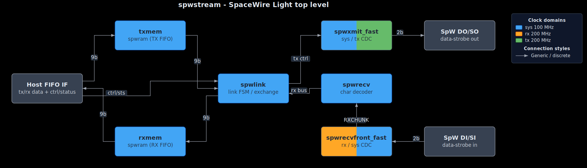

# SpaceWire Light

Copyright 2009-2013 Joris van Rantwijk

## Overview

SpaceWire Light is a SpaceWire encoder-decoder.
It is synthesizable for FPGA targets (up to 200 Mbit on Spartan-3).
Application interfaces include a simple FIFO interface, as well as
an AMBA bus interface for LEON3 system-on-chip designs.

The goal is to provide a complete, reliable, fast implementation
of a SpaceWire encoder-decoder according to ECSS-E-ST-50-12C.
The core is "light" in the sense that it does not provide additional
features such as RMAP, routing etc.

SpaceWire Light supports two application interfaces. One interface
provides FIFO-style access to RX/TX buffers in the core (spwstream).
This interface can be easily integrated into most digital designs.

Alternatively, an AMBA bus interface (spwamba) may be used to integrate
SpaceWire Light into a LEON3 embedded system. This interface supports
DMA-based data transfers. The code for the AMBA interface depends on GRLIB,
a VHDL library from Aeroflex Gaisler. The source of GRLIB must be downloaded
separately from <http://www.gaisler.com/>.

See [doc/Manual.pdf](doc/Manual.pdf) for more information.

## Architecture

Top-level block diagram of the `spwstream` core:

<a href="doc/architecture.svg">
  
</a>

The editable diagram spec [`doc/architecture.json`](doc/architecture.json)
and rendered SVG [`doc/architecture.svg`](doc/architecture.svg) were created
with the [`hdldiagZero`](https://github.com/lcapossio/hdldiagZero) skill.

## Verilog 2001 Translation

The repository also includes a completed Verilog 2001 translation of the
standalone, non-GRLIB SpaceWire Light core under [rtl/verilog](rtl/verilog).
This Verilog translation was completed in 2026 by Leonardo Capossio -
bard0 design.

Translated standalone RTL modules:

* `syncdff`
* `spwram`
* `spwlink`
* `spwxmit`
* `spwxmit_fast`
* `spwrecv`
* `spwrecvfront_generic`
* `spwrecvfront_fast`
* `spwstream`
* `streamtest`

Translated Verilog benches are in [bench/verilog](bench/verilog), including
`spwlink_tb`, `spwlink_tb_all`, `streamtest_tb`, and the `spwstream` smoke
and loopback benches. The `spwlink` bench is stimulus-isomorphic with the
original VHDL bench across the 23-case implementation/configuration sweep
tracked by [parity/spwlink_manifest.yml](parity/spwlink_manifest.yml).

The AMBA/LEON3/GRLIB-dependent VHDL files are intentionally not translated:
`spwamba`, `spwambapkg`, and `spwahbmst`.

CI includes a dedicated VHDL workflow for VHDL lint, regression tests, and
generic/fast `spwstream` synthesis checks. The Verilog workflow runs Verilog
lint, translated Verilog regression tests, original VHDL parity regression
tests, a deterministic VHDL/Verilog trace-equivalence regression,
an observable-signal waveform comparison for the matched `streamtest_trace_tb`,
and a matched synthesis resource comparison for generic and fast `spwstream`
configurations. The trace comparison uses matched `streamtest_trace_tb`
benches and [scripts/compare_vhdl_verilog_traces.py](scripts/compare_vhdl_verilog_traces.py).
The waveform comparison normalizes GHDL/Icarus VCD time units and signal names
for selected top-level observables with
[scripts/compare_vhdl_verilog_waveforms.py](scripts/compare_vhdl_verilog_waveforms.py).
The synthesis comparison uses
[syn/vhdl/spwstream_synth_wrappers.vhd](syn/vhdl/spwstream_synth_wrappers.vhd)
and [scripts/synth_resource_compare.py](scripts/synth_resource_compare.py).
Additional translateHDL formal parity manifests and the current evidence packet
are tracked under [parity/formal](parity/formal).

Run the local HDL lint passes with:

```sh
python scripts/lint_hdl.py --verilog
python scripts/lint_hdl.py --vhdl
```

Verilog lint requires Icarus Verilog and Yosys; VHDL lint requires GHDL. The
Yosys phase runs structural `check -assert` passes to catch issues such as
multi-driven Verilog nets. Use `--skip-yosys` only on machines without Yosys;
CI runs the full Verilog check.

See [rtl/verilog/README.md](rtl/verilog/README.md) for Verilog-specific notes.

## License

Copyright 2009-2011 Joris van Rantwijk

SpaceWire Light is free software; you can redistribute it and/or modify
it under the terms of the GNU General Public License as published by
the Free Software Foundation; either version 2 of the License, or
(at your option) any later version.

SpaceWire Light is distributed in the hope that it will be useful,
but WITHOUT ANY WARRANTY; without even the implied warranty of
MERCHANTABILITY or FITNESS FOR A PARTICULAR PURPOSE. See the
GNU General Public License for more details.

You should have received a copy of the GNU General Public License along
with the SpaceWire Light package. If not, see <http://www.gnu.org/licenses/>.

In addition, the parts of SpaceWire Light which do not depend on GRLIB
may be distributed under the terms of the GNU Lesser General Public License
as published by the Free Software Foundation; either version 2.1 of the
License, or (at your option) any later version.

You should have received a copy of the GNU Lesser General Public License along
with the SpaceWire Light package. If not, see <http://www.gnu.org/licenses/>.

## Version History

### 2026-05-08 - Author: Leonardo Capossio

* Completed the Verilog 2001 translation of the standalone, non-GRLIB
  SpaceWire Light RTL and test benches.
* Added CI coverage for VHDL regression/synthesis, Verilog lint, translated
  Verilog regression tests, original VHDL parity regression tests,
  VHDL/Verilog trace-equivalence and observable waveform regressions, and
  matched VHDL/Verilog synthesis resource comparison.
* Completed stimulus-isomorphic `spwlink` testbench parity. The Verilog
  `spwlink_tb_all` mirrors the original VHDL 23-case configuration sweep, and
  `bench/verilog/spwlink_tb.v` translates the VHDL bit-pattern stimulus,
  output monitor, and state/error assertions tracked by the parity manifest.

### 2013-05-04

* spwahbmst.vhd: Correctly handle 64-bit AHB bus.
  Many thanks to Tam Do for reporting this bug.
* Updates to support GRLIB 1.2.2.
* Manual: update to refer to GRLIB 1.2.2.

### 2013-02-04

* spwrecvfront_generic.vhd: Correctly handle situation where incoming
  Data/Strobe signals are not '0' at the beginning of the link setup.
  Many thanks to Goekce Aydos for reporting this bug.

### 2011-08-11

* spwahbmst.vhd: Fix incorrect "hsize" indication on AHB access.
  Many thanks to Soren Larsen for reporting this bug.

### 2011-07-10

* spwamba_test.c: Longer delays to run correctly on 100 MHz LEON3.
* spwltest.c: Allow smaller user-defined block size; skip unnecessary tests.
* License changed to allow LGPL in addition to GPL for non-GRLIB parts.

### 2011-02-11

* spwamba: Add tick_out signal.
* swprecvfront_fast: Simplified data transfer between clock domains.
* Clean up synchronization of data paths between clock domains.

### 2010-12-03

* Add RTEMS driver and test program for SPWAMBA.
* Add documentation for SPWAMBA.
* spwamba: Change TX FIFO management; start new transfer when there is room
  for a maximum burst instead of aiming for 3/4 fill rate.
* spwamba: Do not reset spwxmit in response to software reset.
* spwamba: Fix bug in maximum burst size calculation.
* spwamba: Optimize address generation in burst state machine.
* spwamba: More careful calculation of RX credit.

### 2010-09-21

* Add AMBA interface (preliminary version, untested, undocumented).
* License changed from LGPL to GPL.
* Again fix an issue with EEP injection on link loss.
* Add DATAPATHONLY keyword to timing constraints.

### 2010-09-12

* Fixed issue with automatic discarding of TX data after link error.
* After link error, spwstream will terminate current packet with EEP even
  if the linkdisable signal is active.
* Added code comment to clarify a dependency between spwrecv and spwlink.
  (Thanks to Rafael Corsi Ferrao for reporting this obscurity.)

### 2010-07-12

* Added manual.
* Fix incorrect bitrate during link handshake. The system clock frequency
  was used to compute the initial tx clock divider, even when the clock
  divider would act on the txclk instead of the system clock.
* Improve fast transmitter. Sending FCT tokens at high bit rate no longer
  causes insertion of a NULL token.

### 2010-06-08

* Initial release.

## Contact

For the latest version of this core, see the OpenCores project page.

For more information, comments, suggestions or bug reports, either
go to the OpenCores project page or email me directly.

Project page at OpenCores:
<http://opencores.org/project,spacewire_light>

Email:
joris (at) jorisvr (dot) nl

Verilog translation author: Leonardo Capossio - bard0 design - www.bard0.com - hello@bard0.com
